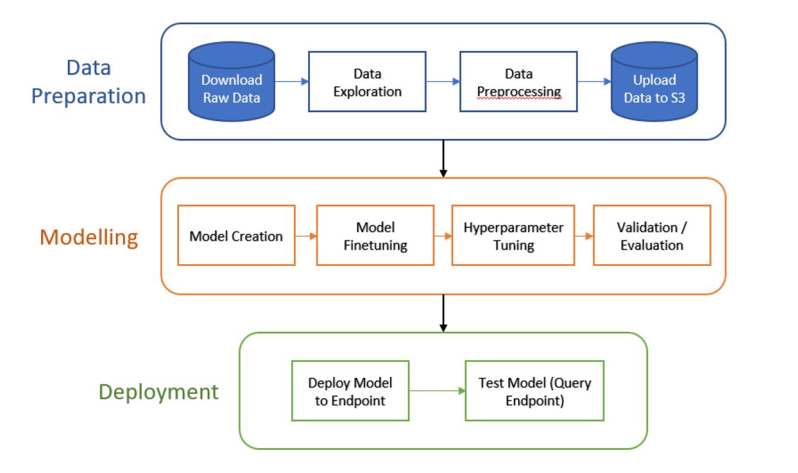
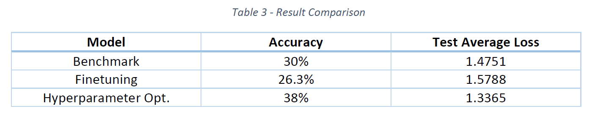
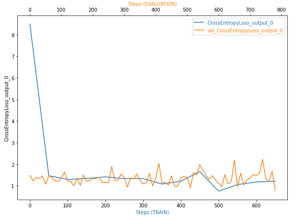

### Table of Contents

 1. [Installation](#installation)
 2. [Project Motivation](#motivation)
 3. [File Descriptions](#files)
 4. [Results](#results)
 5. [Licensing, Authors, and Acknowledgements](#licensing)

## Installation 

 The necessaries modules to run this project are:

 - torch
 - torchvision
 - tqdm
 - smdebug
 - os
 - io
 - numpy
 - matplotlib
 - pandas
 - numpy
 - sagemaker
 - boto3
 - PIL
 - json
 - math
 - shutil
 - IPython
 - argparse
 - logging
 - sys
 - requests

 These modules, if not native to the python version being used, can be installed via the terminal using "pip install <module name>" (e.g. pip install torch).

 The code should run with no issues using Python versions 3.*.

## Project Motivation

 This machine learning project consists in the creation and training of an image classifier using pretrained convolutional networks for identifying the number of items in images of bins used by Amazon.

 The dataset used for this project can found in this [link](https://registry.opendata.aws/amazon-bin-imagery/). The data was divided into three datasets (train, test and evaluation). 
 Each of these phases has its own folders containing subfolders representing the different classes. Each class holds images for bins with different number of items.

 The pretrained model chosen for this projet was ResNet50.

 The main learning goals for this project were:
 - Perform data preprocessing in order to prepare it for model training;
 - Perform model finetuning and hyperparameter optimization on the pretrained imported model;
 - Observe instance metrics and model variables throughout training using sagemaker profiler and debugger (smdebugger);
 - Deploy the optimized model to a Sagemaker endpoint and query it in order to obtain predictions.

 A diagram of the project summarizing the objectives and workflow can be seen below:

 

## File Descriptions 

List of files:

 - sagemaker.ipynb: Jupyter notebook used to download data, create models, define hyperparameters tuning search space, extract information, create profiler and debugger reports, deploy models and query the endpoint.
 - benchmark_model.py: Python training script used for the creation and training of the benchmark model.
 - model_finetuninf.py: Python training script used for model finetuning.
 - hpo.py: Python training script used for hyperparameter optimization.
 - hook_training_script.py: Python training script used for profiler and debugger insertion.
 - inference.py: Python script used for the creation of the PyTorch model deployed to the endpoint. It contained the rules for how the model would be handled by Sagemaker, how the prediction requests would be processed by Sagemaker and delivered to the deployed model and the transformations that the input data for the predictions would undergo in order to be used by the model.

 Markdown cells and comments in code cells present in the train_and_deploy notebook were used to assist the understanding of the code.

## Results

The hyperparameters iterated over during optimization were: learning rate, epochs and training batch size and the observed variable used for definition of the best model was average test loss. The results of the process is shown below:

Details of the model finetuning and hyperparameter optimization development can be observed in its section in the project notebook.

The results for the debugger observed variable (CrossEntropyLoss_output):

The profiler report is displayed in the project notebook.

## Licensing, Authors, Acknowledgements

 I want to give credit to Udacity and Amazon for the data and opportunity. Feel free to use the code here!
